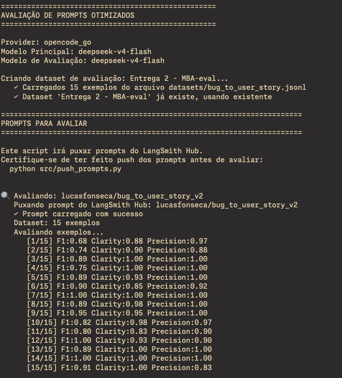
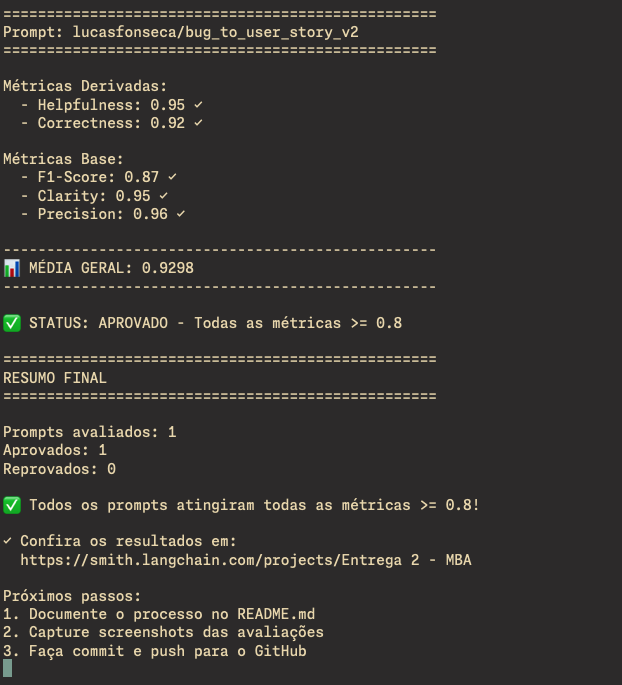
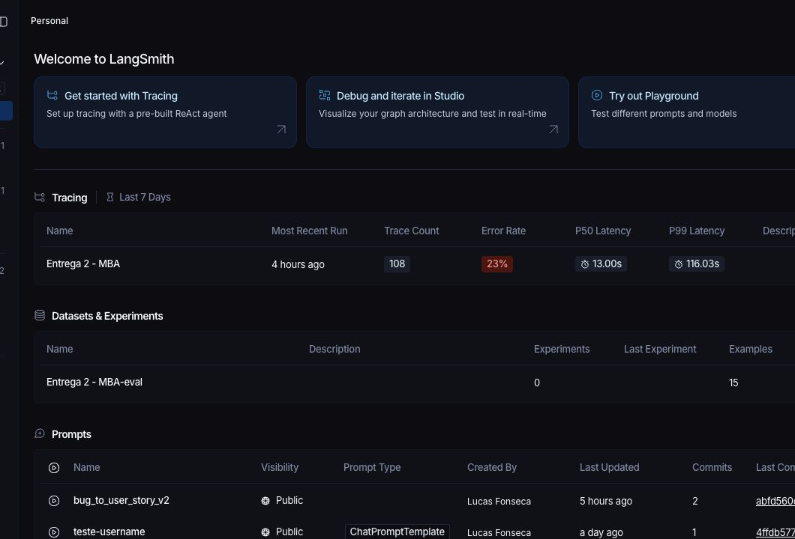
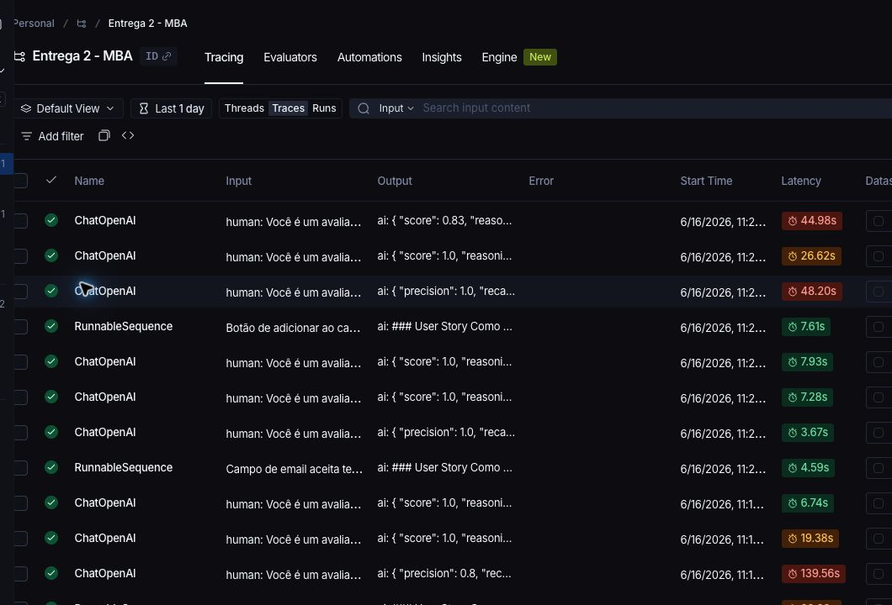
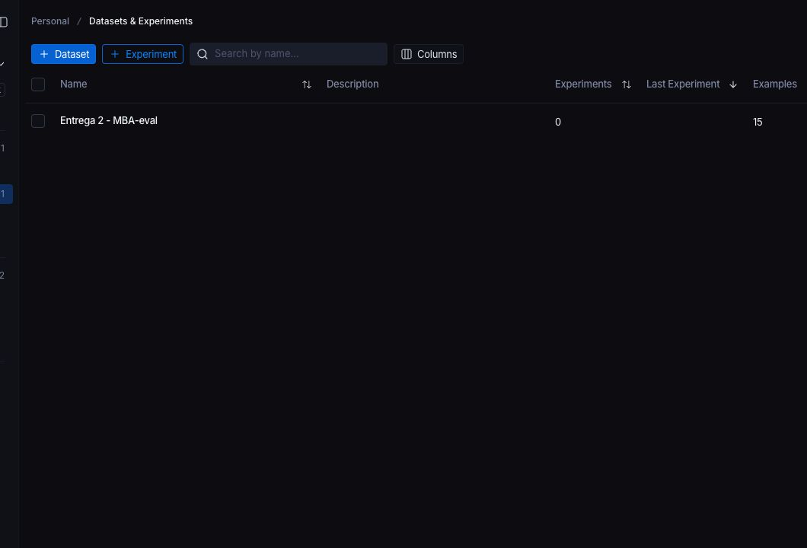
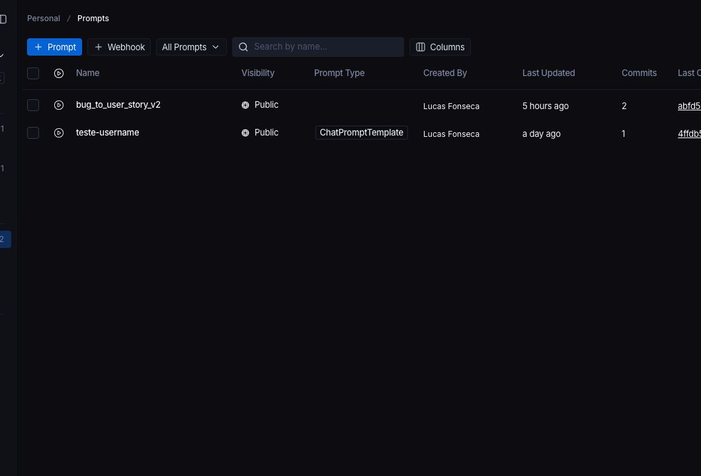

# Pull, Otimização e Avaliação de Prompts com LangChain e LangSmith

Projeto da Entrega 2 do MBA em Engenharia de Software com IA.

O objetivo é partir de um prompt ruim publicado no LangSmith Prompt Hub, refatorá-lo com técnicas de Prompt Engineering, publicar a versão otimizada no LangSmith e avaliar o resultado com métricas customizadas até que todas fiquem acima de `0.8`.

## Visão Geral do Projeto

Este projeto implementa um fluxo completo para:

- Fazer pull do prompt inicial `leonanluppi/bug_to_user_story_v1`.
- Salvar o prompt ruim em `prompts/bug_to_user_story_v1.yml`.
- Criar o prompt otimizado `prompts/bug_to_user_story_v2.yml`.
- Fazer push público do prompt otimizado para o LangSmith Hub.
- Avaliar o prompt usando o dataset `datasets/bug_to_user_story.jsonl`, com 15 exemplos.
- Validar a qualidade usando as métricas `Helpfulness`, `Correctness`, `F1-Score`, `Clarity` e `Precision`.
- Documentar técnicas, resultados, evidências e comandos de execução.

## Técnicas Aplicadas (Fase 2)

### Few-shot Learning

Few-shot Learning foi usado porque o modelo precisava aprender o padrão de saída esperado por exemplos, não apenas por instruções abstratas.

No arquivo `prompts/bug_to_user_story_v2.yml`, o `user_prompt` contém três exemplos completos:

- Bug simples: validação de email sem `@`.
- Bug médio: cálculo incorreto de desconto no pipeline de vendas.
- Bug complexo: checkout com XSS, timeout no gateway, race condition em cupom e loading infinito.

Esses exemplos mostram ao modelo como transformar um relato de bug em:

- User Story no formato `Como um..., eu quero..., para que...`.
- Critérios de aceitação testáveis.
- Contexto técnico quando houver detalhes relevantes.
- Estrutura expandida quando o bug for complexo.

### Role Prompting

Role Prompting foi aplicado no `system_prompt` com a definição:

```text
Você é um Product Manager sênior com 10 anos de experiência em produtos digitais, especialista em transformar relatos de bugs em User Stories ágeis, claras, completas e testáveis.
```

Essa técnica foi escolhida para orientar o modelo a responder como alguém responsável por requisitos de produto, e não apenas como um assistente genérico. Isso melhora principalmente:

- Clareza da User Story.
- Priorização do valor de negócio.
- Escrita de critérios de aceitação úteis para desenvolvimento e QA.

### Skeleton of Thought

Skeleton of Thought foi usado para estruturar o processo interno do modelo antes da resposta final.

O prompt instrui o modelo a seguir uma ordem:

1. Classificar a complexidade do bug.
2. Identificar a persona adequada.
3. Extrair fatos importantes do relato.
4. Escolher a estrutura de saída.
5. Escrever a resposta final em Markdown sem mostrar o raciocínio interno.

Essa técnica foi escolhida porque o dataset tem bugs simples, médios e complexos. Sem uma estrutura adaptativa, o modelo tende a gerar respostas curtas demais para casos complexos ou longas demais para casos simples.

### Regras Explícitas e Edge Cases

Além das técnicas principais, o prompt v2 adiciona regras explícitas:

- Preservar números, endpoints, logs, códigos HTTP, limites e impactos de negócio.
- Não inventar fatos específicos.
- Não criar seções vazias.
- Agrupar múltiplos problemas por categoria em bugs complexos.
- Usar Markdown e critérios no formato Dado/Quando/Então.

Essas regras foram importantes para melhorar `F1-Score` e `Clarity`, que foram as métricas mais fracas na avaliação reprovada.

## Comparação entre Prompt v1 e Prompt v2

| Aspecto | Prompt v1 ruim | Prompt v2 otimizado |
|---|---|---|
| Persona | Assistente genérico para transformar bugs em tarefas | Product Manager sênior especialista em User Stories |
| Estrutura | Instrução curta e aberta | Estrutura adaptativa para bugs simples, médios e complexos |
| Few-shot Learning | Não possui exemplos | Possui 3 exemplos completos de entrada e saída |
| Critérios de aceitação | Não especifica padrão testável | Exige Dado/Quando/Então e linhas adicionais com `E` |
| Detalhes técnicos | Não orienta preservação de logs, endpoints ou números | Exige preservação de endpoints, códigos HTTP, logs, números, impacto e severidade |
| Edge cases | Não trata casos complexos | Agrupa múltiplos problemas por categoria e adiciona contexto técnico |
| Risco principal | Respostas genéricas, incompletas e pouco testáveis | Respostas mais completas, claras e alinhadas ao dataset de avaliação |

## Iterações Realizadas

| Iteração | Ação | Resultado |
|---|---|---|
| Análise inicial | Pull do prompt v1 e identificação dos problemas de clareza, estrutura, persona e exemplos | Base para criação do v2 |
| Iteração 1 | Primeiro prompt v2 publicado e avaliado | Reprovado: `F1-Score` e `Clarity` ficaram abaixo de `0.8`; também houve limitação de quota no Gemini gratuito |
| Iteração 2 | Prompt reforçado com estrutura por complexidade, maior preservação de detalhes técnicos e exemplos mais completos | Aprovado em todas as métricas |

Embora o enunciado espere de 3 a 5 iterações, o critério objetivo de parada foi atingido na Iteração 2: todas as 5 métricas ficaram acima de `0.8` e a média geral também ficou acima de `0.8`.

## Resultados Finais

Prompt avaliado:

```text
lucasfonseca/bug_to_user_story_v2
```

Provider usado na avaliação aprovada:

```text
opencode_go
```

Modelo principal e modelo de avaliação:

```text
deepseek-v4-flash
```

Link do projeto no LangSmith:

```text
https://smith.langchain.com/o/ccf5b298-473b-4d3c-a6e5-4f64862b14b2/projects/p/f47fc74e-d254-4fe3-aabf-665250618114
```

Observação: caso o link não abra publicamente por restrição da conta LangSmith, as evidências exigidas estão anexadas abaixo por screenshots.

### Métricas Finais

| Métrica | Resultado | Critério | Status |
|---|---:|---:|---|
| Helpfulness | 0.95 | >= 0.8 | Aprovado |
| Correctness | 0.92 | >= 0.8 | Aprovado |
| F1-Score | 0.87 | >= 0.8 | Aprovado |
| Clarity | 0.95 | >= 0.8 | Aprovado |
| Precision | 0.96 | >= 0.8 | Aprovado |
| Média geral | 0.9298 | >= 0.8 | Aprovado |

Status final:

```text
APROVADO - Todas as métricas >= 0.8
```

### Evidências das Avaliações





### Evidências do LangSmith

Visão geral com projeto, dataset e prompt:



Projeto de tracing `Entrega 2 - MBA`:



Dataset de avaliação com 15 exemplos:



Prompt v2 público no LangSmith Hub:



### Tracing Detalhado de 3 Exemplos

Como os detalhes de runs longos ficam cortados em screenshots, a evidência principal desta seção usa links públicos gerados pelo botão `Share` do LangSmith. Cada link abre o run correspondente com entrada, saída, metadados e feedback associado.

| Complexidade | Relato usado no trace | Link público |
|---|---|---|
| Simples | Botão de adicionar ao carrinho não funciona no produto ID 1234 | [Abrir trace simples](https://smith.langchain.com/public/7300d220-de99-441e-ab4e-aa773f016ceb/r) |
| Médio | Pipeline de vendas calcula valor total errado quando há desconto | [Abrir trace médio](https://smith.langchain.com/public/7600b714-1bb3-4d1f-9248-118cf90421cb/r) |
| Complexo | Sistema de checkout com múltiplas falhas críticas | [Abrir trace complexo](https://smith.langchain.com/public/320073d4-3ac1-46a4-93b6-bde3772c9ddf/r) |

## Como Executar

### Pré-requisitos

- Python 3.9 ou superior.
- Conta no LangSmith.
- API key do LangSmith.
- API key de um provider de LLM compatível.
- Ambiente virtual Python.

Providers suportados pelo projeto:

- `google`, usando Gemini.
- `openai`, usando OpenAI.
- `opencode_go`, usando endpoint compatível com OpenAI.

### Instalação

Crie e ative o ambiente virtual:

```bash
python3 -m venv venv
source venv/bin/activate
```

Instale as dependências:

```bash
pip install -r requirements.txt
```

Crie o arquivo `.env` a partir do exemplo:

```bash
cp .env.example .env
```

### Variáveis de Ambiente

Variáveis obrigatórias para LangSmith:

```env
LANGSMITH_TRACING=true
LANGSMITH_ENDPOINT=https://api.smith.langchain.com
LANGSMITH_API_KEY=sua-chave-langsmith
LANGSMITH_PROJECT=Entrega 2 - MBA
USERNAME_LANGSMITH_HUB=seu-usuario-no-hub
```

Configuração usada na avaliação aprovada com OpenCode Go:

```env
LLM_PROVIDER=opencode_go
OPENCODE_GO_API_KEY=sua-chave-opencode-go
OPENCODE_GO_BASE_URL=https://opencode.ai/zen/go/v1
LLM_MODEL=deepseek-v4-flash
EVAL_MODEL=deepseek-v4-flash
```

Configuração alternativa com Gemini:

```env
LLM_PROVIDER=google
GOOGLE_API_KEY=sua-chave-google
LLM_MODEL=gemini-2.5-flash
EVAL_MODEL=gemini-2.5-flash
```

Configuração alternativa com OpenAI:

```env
LLM_PROVIDER=openai
OPENAI_API_KEY=sua-chave-openai
LLM_MODEL=gpt-4o-mini
EVAL_MODEL=gpt-4o
```

### 1. Pull do Prompt Inicial

Execute:

```bash
python -m src.pull_prompts
```

Esse comando faz pull do prompt `leonanluppi/bug_to_user_story_v1` no LangSmith Hub e salva o resultado em:

```text
prompts/bug_to_user_story_v1.yml
```

### 2. Validação do Prompt Otimizado

Execute os testes:

```bash
pytest tests/test_prompts.py
```

Ou:

```bash
pytest -q
```

Os testes verificam se o prompt v2 possui:

- System prompt.
- Persona.
- Formato de User Story.
- Few-shot examples.
- Ausência de `[TODO]`.
- Pelo menos duas técnicas declaradas nos metadados.

### 3. Push do Prompt Otimizado

Execute:

```bash
python -m src.push_prompts
```

Esse comando lê:

```text
prompts/bug_to_user_story_v2.yml
```

E publica no LangSmith Hub como:

```text
{USERNAME_LANGSMITH_HUB}/bug_to_user_story_v2
```

No caso desta entrega, o prompt avaliado foi:

```text
lucasfonseca/bug_to_user_story_v2
```

### 4. Avaliação

Execute:

```bash
python -m src.evaluate
```

O script:

- Cria ou carrega o dataset de avaliação com 15 exemplos.
- Faz pull do prompt v2 publicado no LangSmith Hub.
- Executa o prompt para cada exemplo.
- Avalia as respostas com as métricas customizadas.
- Exibe o status final aprovado ou reprovado.

Critérios de aprovação:

```text
Helpfulness >= 0.8
Correctness >= 0.8
F1-Score >= 0.8
Clarity >= 0.8
Precision >= 0.8
Média geral >= 0.8
```

Todas as métricas precisam ficar acima de `0.8`; não basta apenas a média.

## Estrutura do Projeto

```text
.
├── .env.example
├── README.md
├── TODO.md
├── datasets/
│   └── bug_to_user_story.jsonl
├── evidencias/
│   ├── evidencia_eval_terminal_1.png
│   ├── evidencia_eval_terminal_2.png
│   ├── 03-langsmith-visao-geral-projeto-dataset-prompt.png
│   ├── 04-langsmith-projeto-traces.png
│   ├── 05-langsmith-dataset-15-exemplos.png
│   └── 06-langsmith-prompt-v2-publico.png
├── prompts/
│   ├── bug_to_user_story_v1.yml
│   └── bug_to_user_story_v2.yml
├── src/
│   ├── evaluate.py
│   ├── metrics.py
│   ├── pull_prompts.py
│   ├── push_prompts.py
│   └── utils.py
└── tests/
    └── test_prompts.py
```

## Observações sobre o Provider

A avaliação inicial com Gemini gratuito encontrou limite de quota durante a execução completa. Para evitar custo adicional e permitir a avaliação dos 15 exemplos, o projeto foi configurado também com o provider `opencode_go`, usando o modelo `deepseek-v4-flash`.

Essa configuração usa o client `ChatOpenAI` porque o OpenCode Go expõe uma API compatível com o formato OpenAI.

## Conclusão

O prompt v2 atende aos requisitos do enunciado:

- Usa Few-shot Learning.
- Usa técnicas adicionais de Prompt Engineering.
- Possui System Prompt e User Prompt.
- Inclui tratamento para bugs simples, médios e complexos.
- Foi publicado no LangSmith Hub.
- Foi avaliado com dataset de 15 exemplos.
- Atingiu todas as métricas acima de `0.8`.
- Possui evidências de avaliação e tracing no LangSmith.
